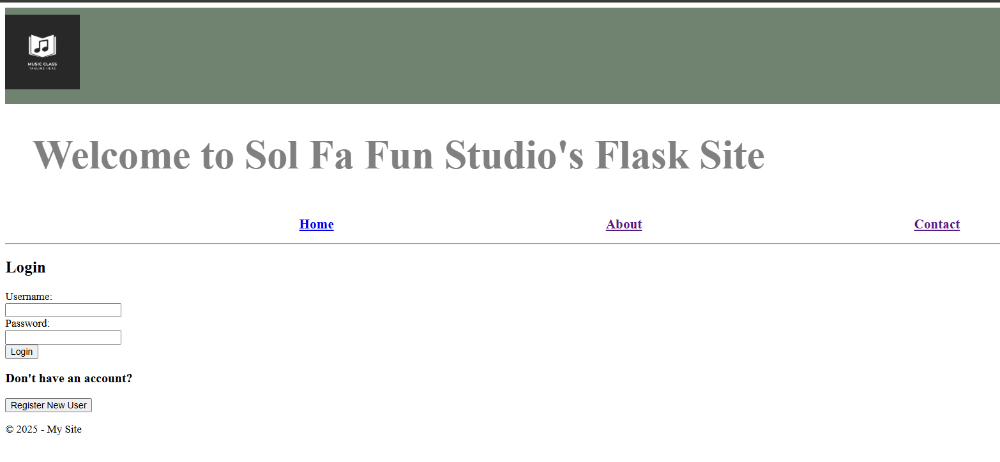
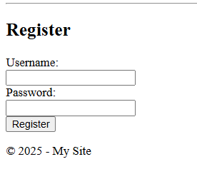
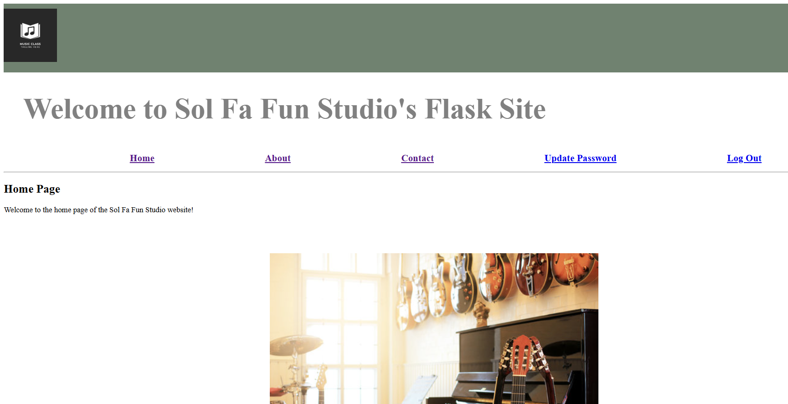
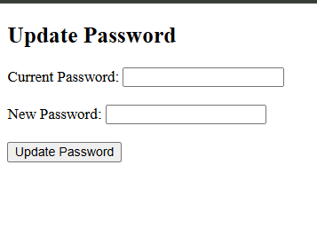

# Flask Secure Authentication

---

A Flask web application that demonstrates secure user authentication, password management, 
session handling, and access control using Passlib for password hashing. The project was designed 
around a private music studio to illustrate how authentication features can be integrated into a small business website.


## Overview

---
This project demonstrates the implementation of secure authentication features within a Flask web application. Users can register new accounts, securely log in, update passwords, and access protected pages while following common authentication and password security practices.

The application is presented as a private music studio website, illustrating how authentication can be incorporated into a real-world small business scenario.

## Features

---
- User registration
- Secure login and logout
- Password hashing
- Password complexity enforcement
- Common password detection
- Password update functionality
- Session-based authentication
- Protected routes
- Flash messaging
- Failed login logging

## Security Features

- Passwords are securely hashed before storage.
- Password complexity requirements help enforce stronger credentials.
- Common passwords are rejected to improve account security.
- Failed login attempts are recorded for auditing purposes.
- User sessions protect authenticated resources.

## Technologies

This project was developed using the following technologies:
- Python
- Flask
- Passlib
- Jinja2
- HTML5
- CSS3
- Git

## Screenshots

### Login



### Register



### Home



### Update Password



## Testing

---
The application was manually tested to verify authentication, account management, password security, session handling, and input validation. Both successful workflows and invalid user actions were tested to ensure secure behavior.

### Authentication Testing

- User registration with valid credentials
- Persistent account storage across application restarts
- Successful user login and logout
- Invalid username rejection
- Invalid password rejection
- Incorrect username/password combinations handled securely
- Duplicate username detection
- Required username and password fields enforced

### Password Security Testing

- Username minimum length validation
- Password complexity requirements enforced
- Password updates using the current password
- Incorrect current password rejection
- Common password detection and rejection
- Successful password updates using secure validation

### Security Testing

- Failed login attempts recorded with timestamp, username, and IP address
- Protected pages require authentication
- Session isolation verified by attempting to access authenticated pages from a different browser
- Unauthorized users redirected to the login page

### Application Testing

- Navigation between all application pages
- Images, tables, and static assets loaded correctly
- Flask templates rendered properly
- User interface validated across all implemented features

### Static Analysis

The project was analyzed using **Pylint** throughout development. Code quality improvements included documentation, import organization, and general refactoring, resulting in a final score above **9/10** while maintaining application functionality.

### Result

All authentication, security, and application functionality tests passed successfully.

## Installation

---
### Clone the repository

```bash
git clone https://github.com/jcrosbybuilds/flask-secure-authentication.git
```

### Navigate to the project

```bash
cd flask-secure-authentication
```

### Create a virtual environment (recommended)

**Windows**

```bash
python -m venv .venv
.venv\Scripts\activate
```

**macOS / Linux**

```bash
python3 -m venv .venv
source .venv/bin/activate
```

### Install dependencies

```bash
pip install -r requirements.txt
```

### Run the application

```bash
python app.py
```

Open your browser and navigate to:

```
http://127.0.0.1:5000
```

## Project Structure

---
```text
flask-secure-authentication/
├── app.py
├── common_password.txt
├── requirements.txt
├── README.md
├── .gitignore
├── screenshots/
├── static/
└── templates/
```

## What I Learned

---
This project strengthened my understanding of:

- Building secure web applications with Flask
- Implementing session-based authentication
- Applying password hashing and validation techniques
- Protecting application routes from unauthorized access
- Logging authentication events for auditing
- Organizing a Flask project for maintainability
- Using Git and GitHub to manage project development

## Future Improvements

---
Potential enhancements include:

- Store users in a relational database instead of a text file
- Implement email-based password reset
- Add multi-factor authentication
- Strengthen password policy with configurable rules
- Add automated unit tests
- Deploy the application to a cloud platform